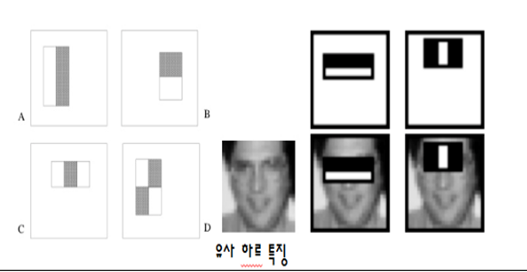

활동기관 : 교내 학술 동아리
기간 : 2017.03 ~ 2017.06

* opencv 이용 얼굴 인증 시스템을 이용하여 이미지 가공 및 합성 
* 영상에서 객체의 특징을 찾기위한 Haar-like feature 학습 
* Haar Classifier을 이용한 얼굴 검출 
* 검출한 영역 프레임에 이미지 합성

### Haar-like feaure (유사 하르 특징)

영상에서 객체의 특징을 찾기위한 기법으로 아래 보이는 사각형으로 얼굴을 찾을 수 있다.




유사하르 특징은 사람의 얼굴에 특별한 패턴이 있다고 얼굴위에 흑백의 사각형을 겹쳐 밝은 영역에 속한 픽셀 값들의 평균에서 어두운 영역에 속한 픽셀값들의 평균차를 구한 후 그 차이가 일정값 이상으로 커지면 유사 하르 특징이 있다고 판단한다.

### Flow


### Code

```python
import cv2
CAM_ID = 0
cap = cv2.VideoCapture(CAM_ID)

cv2.namedWindow('snow')


img_url="image/limkinam.jpg"


face_cascade=cv2.CascadeClassifier()
face_cascade.load('haarcascade.xml')


while(True):
    ret, frame = cap.read()
 
    grayframe = cv2.cvtColor(frame, cv2.COLOR_BGR2GRAY)
    grayframe = cv2.equalizeHist(grayframe)

    faces = face_cascade.detectMultiScale(grayframe, 1.1, 3, 0, (30, 30))

    for (x,y,w,h) in faces:
        k=float(w)
        image = cv2.imread(img_url,1)
        r = k/image.shape[1]
        dim = (int(k), int(image.shape[0]*r))
        img = cv2.resize(image, dim, interpolation = cv2.INTER_AREA)
        imgROI = frame[y:y+h,x:x+w]
        img2 = img[0:h,0:w]

        img2gray = cv2.cvtColor(img2, cv2.COLOR_BGR2GRAY)
        ret, mask = cv2.threshold(img2gray, 10, 255, cv2.THRESH_BINARY)
        mask_inv = cv2.bitwise_not(mask)
        img1_fg = cv2.bitwise_and(img2, img2, mask =mask)
        dst = cv2.add(img1_fg, imgROI)
        frame[y:y+h,x:x+w]=dst
    cv2.imshow('snow',frame)
    if cv2.waitKey(1) >=0:
        break

cap.release()
cv2.destroyWindow('snow')
```


### Result


    
    
 
