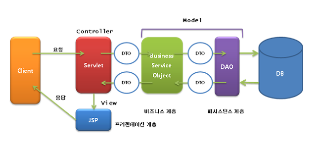
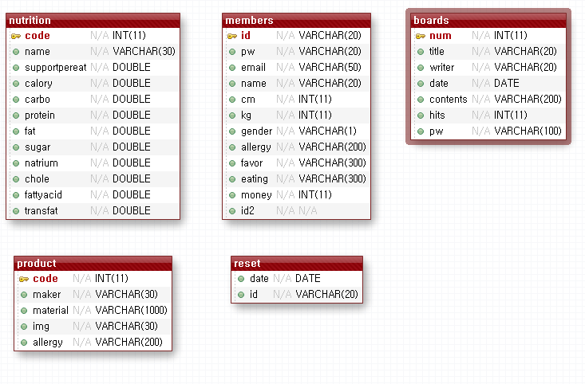
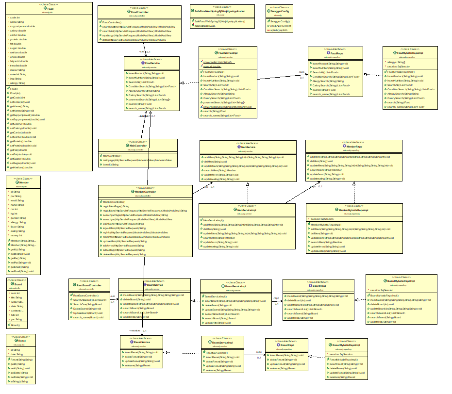
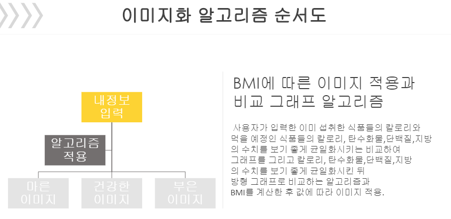
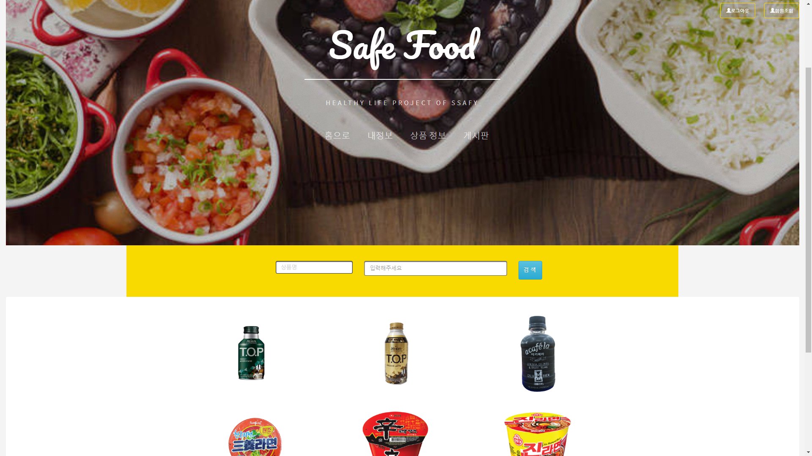
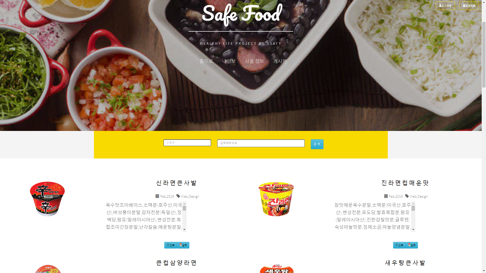
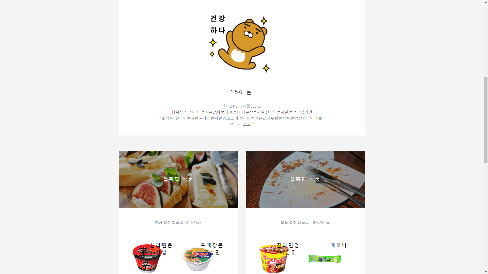
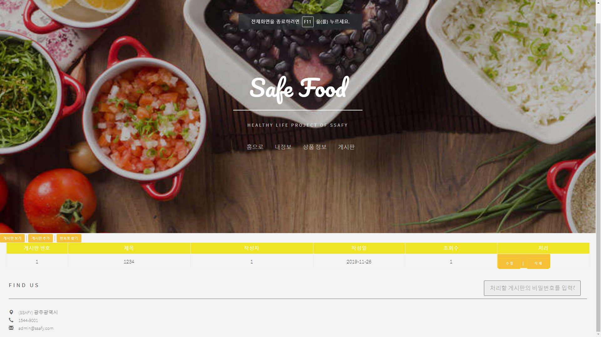
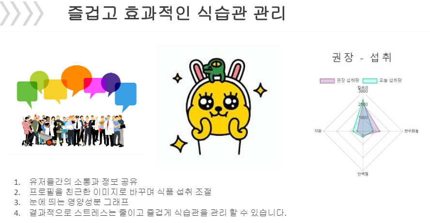

 * 활동기관 : 삼성 SW 아카데미  
 * 활동기간 : 2019.10 ~ 2019.11  
 * 내용 : 안전먹거리를 주제로 회원들의 BMI, 알레르기, 일일 권장 섭취량 등을 관리 해주는 Web 서비스 개발

Source Code :  <a href="https://github.com/limkinam/face_recognition" > git hub  </a>

## 개발 구조 및 환경  
>  Version
>  - Java : v1.8
>  - Spring
>  - mybatis : v2.1
>  - Mysql : v8.0
 

 
## 데이터베이스  
  ERD (Entity-Relation Diagram : 개체 관계도)
  : 맴버와 상품 게시판 테이블을 중심
  

 
## Spring  
  [UML] Class Diagram :
 

 
## BMI 알고리즘  
  

 
## 페이지  
 1.메인페이지 : 기본 상품 6개를 전시 [+] 상품명 | 제조사 | 영양분 | 검색기능
 

  
 2.식품 목록 : 모든 식품의 리스트와 간단한 Description
 

  
 3.마이페이지 : 내 정보 및 나의 섭취식품 선호식품을 바탕으로한 영양 정보 제공
  

  
 4.게시판 : 게시물 등록 수정 제거 기능
  

  
 
## 결과
  

