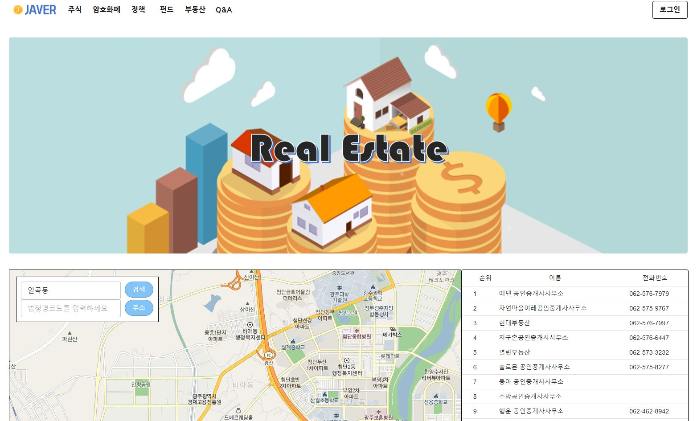

Source Code :  <a href="https://github.com/limkinam/JAVER" > git hub  </a>

## Structue
>  - Spring
>  - mybatis
>  - React.js
>  - MySQL
>  - Beautiful Soup
 

 
## 페이지 
 1.메인페이지 : 서비스에 대한 간략한 내용과 "청년", "금융"을 키워드로 크롤링한 뉴스 기사 제공
 

  
 2.주식페이지 : 코스닥 위주의 주식 정보 제공
 

  
 3.가상화페 페이지:
  

 
 4.정책 페이지 : 청년들을 위한 정책을 창업 | 취업지원 | 생활&복지 | 금융 | 주거 분류하여 제공
  

  
 5.부동산 페이지: 검색을 통해 해당 지역의 부동사 중개소 리스트를 제공
  

  
