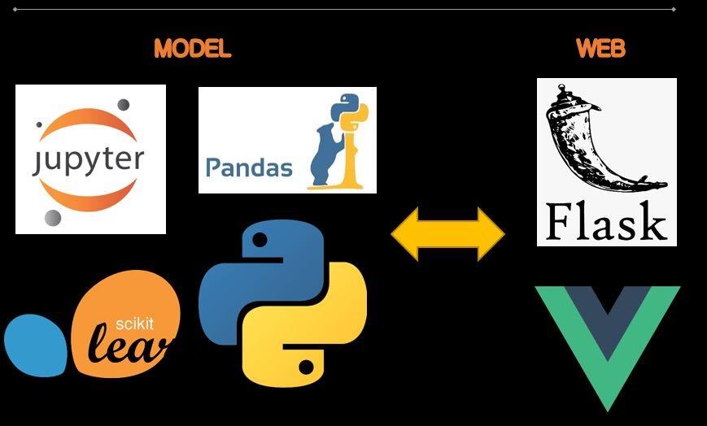
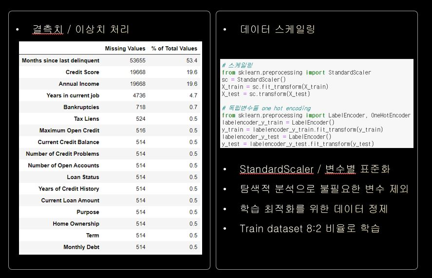
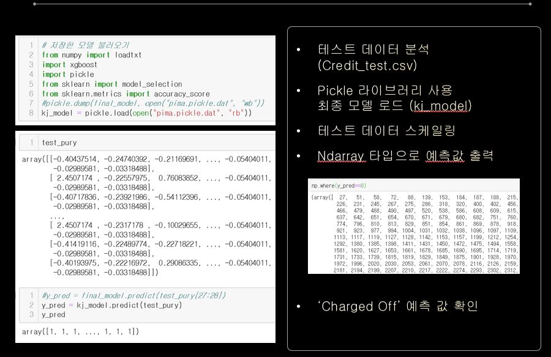
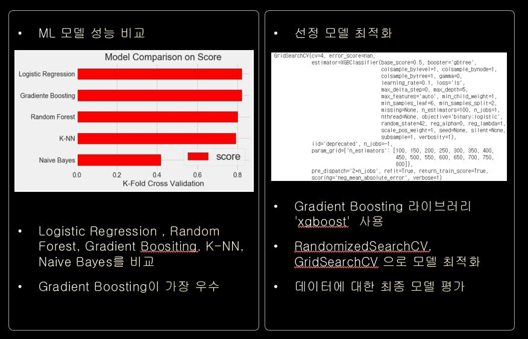
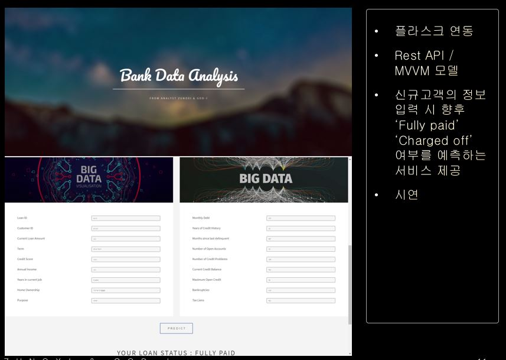

 * 활동기관 : 열혈데이터(스터디 모임)
 * 활동기간 : 2019.11 ~ 2019.12
 * 내용 : Kaggle 금융관련 데이터셋 분석 및 정제를 통해 예측 모델 추출/ 사용자의 웹 서비스 제공  
 * 경험   
  1) 데이터셋의 결측치와 이상치 제거  
  2) Scikit-learn을 활용 데이터 예측 모델 선택(Gradiente Boosting)  
  3) XGBoost를 활용 모델 최적화  
  4) Flask 프레임워크를 이용한 Rest API 개발  
  5) node.js/vue.js를 이용한 웹 서비스 인터페이스 개발  

Source Code :  <a href="https://github.com/limkinam/Bank_Bigdata" > git hub  </a>

## Structue  
>  vue.js  
>  flask  
>  pandas  
>  Scikit-learn
 

 
## DATA PURIFYING

  

## PREDICTION

  

## DATA MODELING  
<figure class="half">
    </a>
    </a>
</figure>  
  
## WEB SERVICE

  
