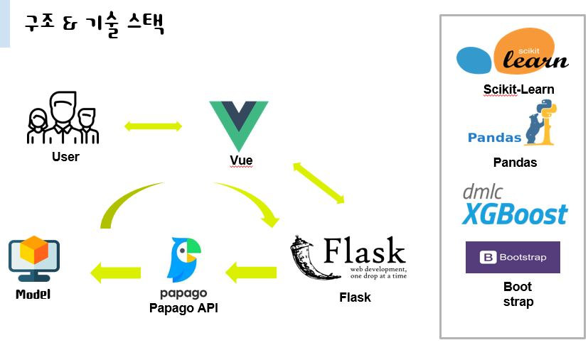
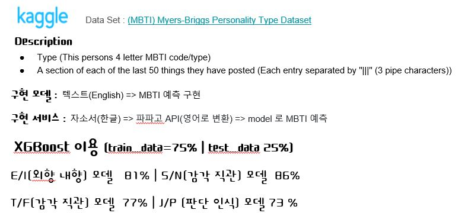

 * 활동기관 : 삼성 SW 아카데미
 * 활동기간 : 2020.03 ~ 2020.04
 * 내용 : 자기소개서 MBTI 분석 서비스
 * 역할  
  1) 데이터셋 분석 및 정제 
  2) XGBoost를 활용 모델 최적화 
  3) Flask 프레임워크를 이용한 Rest API 개발 

Source Code :  <a href="https://github.com/limkinam/MBTI" > git hub  </a>

## Structue  
>  vue.js  
>  flask  
>  pandas  
>  Scikit-learn
>  XGBoost
>  Papago API
 

 
## 분석모델 

  

## 시연동영상 : 
- 면접자의 자소서를 분석하여 MBTI 유형을 판별해준다.
- 각 성격유형 그래프 제공
    1.E/I(외향 내향) 모델
    2.S/N(감각 직관) 모델
    3.T/F(감각 직관) 모델
    4.J/P (판단 인식) 모델
- 각 성격을 결정짓는 KEYWORD 상위 10개를 보여준다
<iframe width="560" height="315" src="../assets/img/MBTI/video.mp4" frameborder="0"> </iframe>

