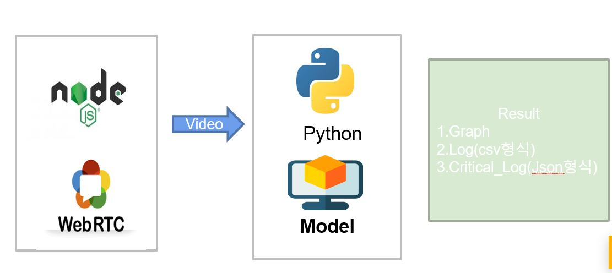
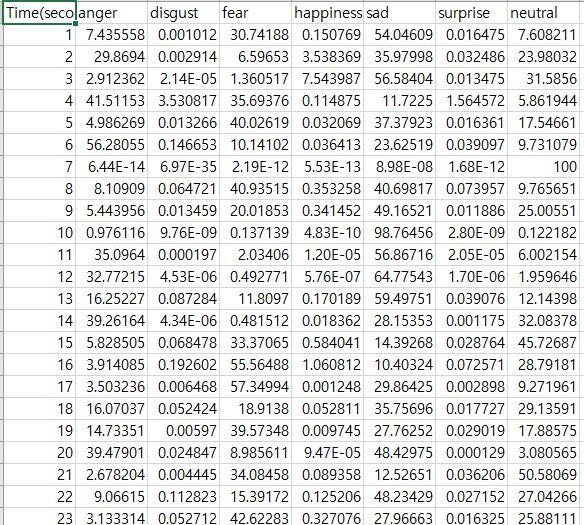
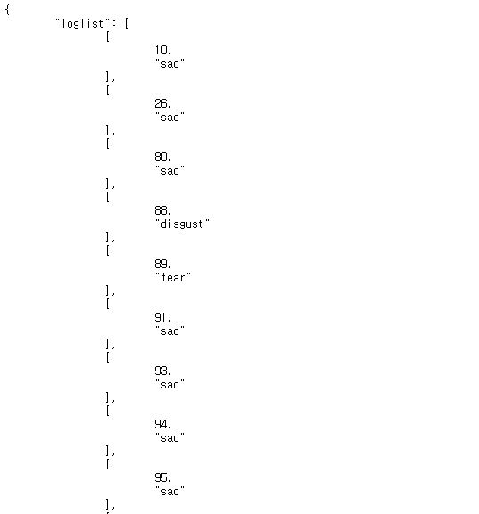
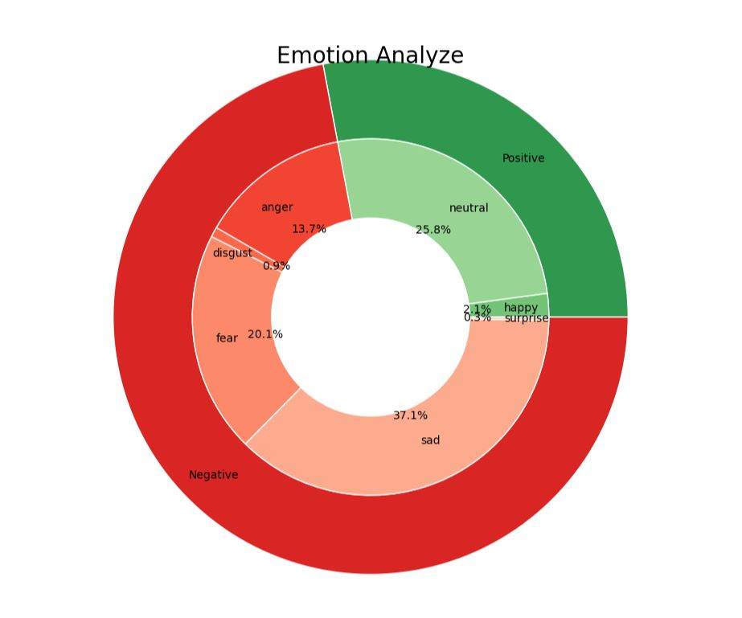
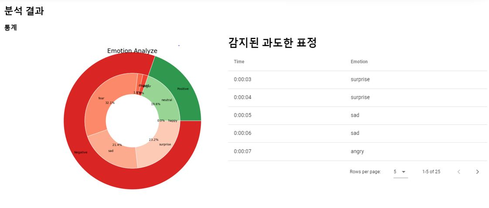

 * 활동기관 : 삼성 SW 아카데미
 * 활동기간 : 2020.03 ~ 2020.04
 * 내용 : 자기소개서 MBTI 분석 서비스
 * 역할  
  1) 데이터셋 분석 및 정제 
  2) XGBoost를 활용 모델 최적화 
  3) Flask 프레임워크를 이용한 Rest API 개발 

Source Code :  <a href="https://github.com/limkinam/Bridge" > git hub  </a>

## Structue  
>  node.js  
>  python  
>  javascript  
>  deepface  
 

 
## WebRTC 이용 화상면접 : 면접관과 면접자간의 화상 면접을 진행하며 면접자는 자신의 영상을 녹화할 수 있다.

  

## AI표정 분석 서비스 : 녹화한 동영상을 분석 => 결과값을 제시한다.
- 결과값1 : 로그 데이터(1초마다 각 분석값) CSV 형식

  
- 결과값2 : Critical 로그 데이터(면접자로서 신경써야할 부정적 감정이 70퍼센트 이상 드러날 경우 찍는 로그) JSON 형식

  
- 결과값3 : Graph 상위 도넛(긍정 / 부정) 하위 도넛( anger / disgust / fear / sad / surprise / happy / neutral) 

  

## 결과값화면 (View 이용 예시) : json데이터와 그래프를 다음과 같이 나타낸다.

  
