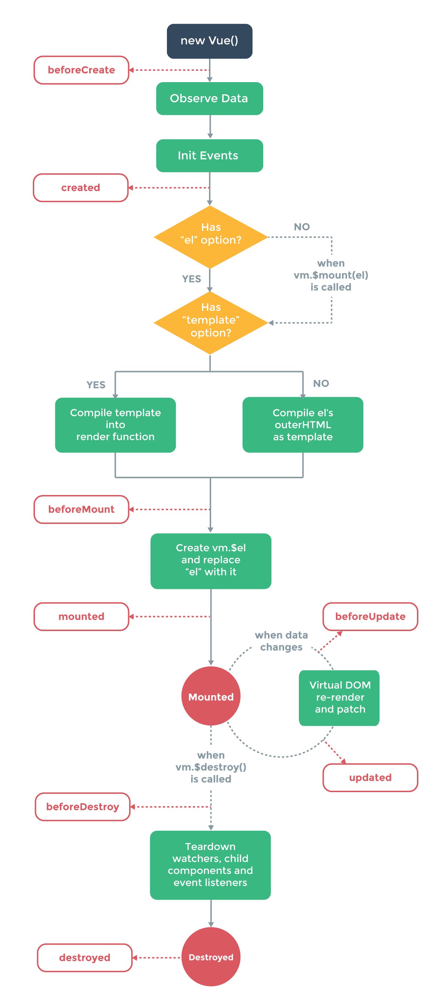

  

## Vue.js  
- 웹 페이지를 개발하기 위한 프론트엔드 프레임워크(SPA구현)
- MVVM 의 View 모델에 해당하는 라이브러리
- 가상 돔 활용 => 실제 돔과 비교하여 DOM의 렌더링을 효율적으로 하여 성능 향상
- 컴포넌트 기반 프레임워크 => 화면이 컴포넌트 트리 구조로 이루어져 재사용성이 증가 및 직관적인 화면 구조
- 앵귤러의 양방향 데이터 바인딩 + 리액트의 단방향 데이터 흐름의 장점
- 배우기 쉽다 => 앵귤러의 TypeScript / React의 JSX(Javacript + XML) 등의 학습 필요  

*JSX : 개발자가 자바스크립트 내부에 마크업 코드를 작성 및 변수나 프로퍼티의 바인딩 기능도 제공

## Vue 라이프 사이클

- 큰 틀에서 Creation, Mounting, Updating, Destruction 구분

## Creation : 컴포넌트 초기화 단계
    - beforeCreation : data와 events가 세팅되지 않은 시점
    - created : data와 events가 활성화 되어 접근 가능하나 템플릿과 가상돔은 마운트 및 렌더링 되지 않은 시점  
    
## Mounting : 돔(DOM)삽입 단계
 - beforeMount : 렌더링이 일어나기 직전 실행(대부분 경우 사용 x)
 - mounted : 컴포넌트,템플릿,렌더링된 돔에 접근가능 
 - 주의 : 부모 자식 컴포넌트 경우 Created(부모) -> Created(자식) -> Mounted(자식) -> Mounted(부모) 순으로 실행  
    
## Updating : 재 렌더링 단계
 - beforeUpdate : 컴포넌트의 데이터가 변하여 업데이트 사이클이 시작될때 | 돔이 재 렌더링되고 패치되기 직전에 실행  
 - updated : 재 랜더링 후 실행
    
## Destruction
 - beforeDestroy : 뷰 인스턴스 제거 되기 전에 호출(컴포넌트는 모든 기능을 가지고 있다.)
 - destroyed : 뷰 인스턴스 제거 후 호출(모든 하위 Vue 인스턴스도 삭제된다.)
    
## Vue-router
 - vue에서 라우팅 기능을 구현할 수 있도록 지원하는 공식 라이브러리  
 - 미리 해당 페이지를 받아 놓고 페이지 이동시 클라이언트의 라우팅을 이용하여 화면을 갱신하여 SPA 실현

|태그|설명|
|------|------|
| router-link to="URL값" | 페이지 이동 태그, 화면에선 a 태그로 치환됨 |
| router-view | 페이지 표시 태그 , 변경된 URL에 따라 해당 컴포넌트를 뿌려주는 영역 |  

## Vuex
 - 컴포넌트의 데이터를 관리하기 위한 상태 관리 패턴이자 라이브러리
 - 구성요소 3가지 : 
     - State : 컴포넌트 간에 공유하는 데이터 data
     - View : 데이터를 표시하는 화면 template
     - Action : 사용자의 입력에 따라 데이터를 변경하는 methods (오직 동기로직인 Mutations를 호출하여 Data 변경)

## Reference
<a hreg="https://medium.com/witinweb/vue-js-%EB%9D%BC%EC%9D%B4%ED%94%84%EC%82%AC%EC%9D%B4%ED%81%B4-%EC%9D%B4%ED%95%B4%ED%95%98%EA%B8%B0-7780cdd97dd4">https://medium.com/witinweb/vue-js-라이프사이클-이해하기-7780cdd97dd4<a>
