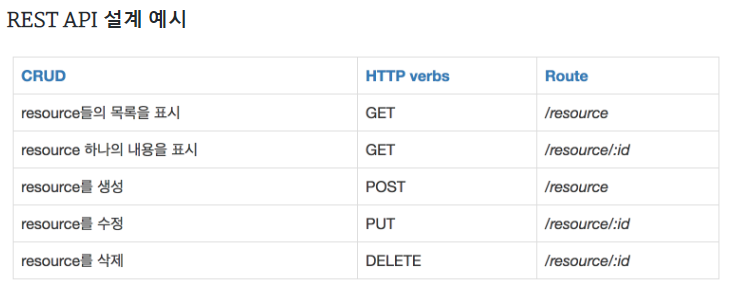

## Rest(Representational State Transfer)
- 자원을 이름(자원의 표현)으로 구분하여 해당 자원의 상태(정보)를 주고 받는 모든 것을 의미
- JSON 혹은 XML를 통해 데이터를 주고 받는 것이 일반적
- HTTP 프로토콜을 그대로 활용하기 때문에 웹의 장점(캐싱 기능)을 최대한 활용할 수 있는 아키텍처 스타일
- 다양한 클라이언트의 등장에 대한 응답과 에플리케이션 분리 가능
- 장 : HTTP 프로토콜에 따르는 모든 플랫폼 사용 가능
- 단 : 메소드가 한정적(4가지)이고 구형 브라우저에서(PUT,DELETE)사용 x

## RestAPI
- 클라이언트가 서버에 요청하는 방식을 정의한 API
- HTTP Method인 POST, GET, PUT, DELETE를 이용하여 CRUD 적용
- 설계 규칙
  - resource : 명사와 소문자 사용 
  - 행위 : HTTP Method(GET, PUT, POST, DELETE )로 표현, URL에 행위동사 사용X
  - '/'는 계층관계를 나타내는데 사용하고 마지막 문자로 사용x
  - '_'는 사용 x, 파일확장자 사용x(Accept header 사용)

## RESTful
- 'Rest API'를 제공하는 웹 서비스
- RESTful한 API를 구현하는 근본적인 목적이 성능 향상에 있는 것이 아니라 일관적인 컨벤션을 통한 API의 이해도 및 호환성을 높이는 것이 주 동기이니, 성능이 중요한 상황에서는 굳이 RESTful한 API를 구현할 필요x

## 응답상태코드
- 1xx : 전송 프로토콜 수준의 정보 교환
- 2xx : 클라어인트 요청이 성공적으로 수행됨
- 3xx : 클라이언트는 요청을 완료하기 위해 추가적인 행동을 취해야 함
- 4xx : 클라이언트의 잘못된 요청
- 5xx : 서버쪽 오류로 인한 상태코드
