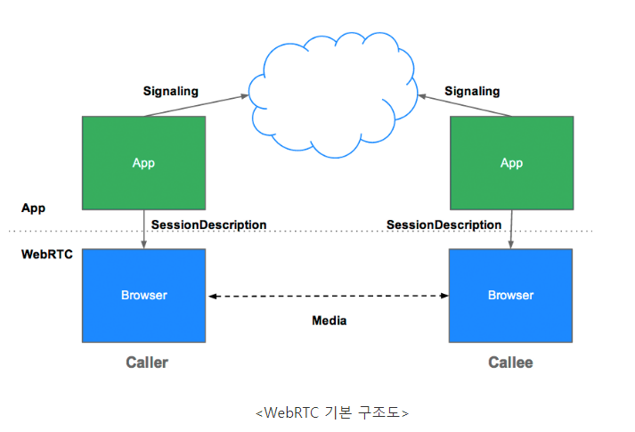

## WebRTC(Web RealTime Communication)
- 별도의 프로그램 설치 없이 웹 브라우저 간에 실시간, 플러그인이 필요 없이 영상 및 음성, 데이터 통신에 대한 공개 된 표준
- P2P로 기기간 Direct 통신이 가능하여 서버의 기능 및 성능이 크게 필요x

## 구조 

- Signaling을 통해 APP간의 3가지 정보를 교환하여 통신이 가능하게한다.
  1. Session Control message : 통신 초기화, 종료, 에러 리포트
  2. Network Configuration : IP Address, Port 교환
  3. Media Capabilities : 웹 브라우저간 코덱 및 해상도 전송
- Signaling 완료시 P2P Streaming으로 웹 브라우저간 Media 통신을 진행한다.

## NAT
- 외부망과 공인망과 내부망의 IP:Port를 매핑해주는 것
- STUN(Session Traversal Utilities for NAT) : 
  - 프로토콜/패킷 포맷으로, 네트워크 환경에 대한 Discovery 지원
  - STUN은 P2P IP 연결을 위한 정보를 제공
  - IP 종단을 연결하기 위해서 어떤 종단에 대한 Public IP Address를 결정하고 NAT/FIrewall의 유형 제공
- TURN(Traversal Using Relays around NAT) :
  - Peer간 직접 통신이 실패할 경우 종단점들 사이에 데이터 릴레이를 수행
  - TURN은 공용 주소들을 가지고 있으며 미디어를 릴레이 하기 때문에 네트워크와 컴퓨팅 자원을 소모
- ICE : 클라이언트의 모든 통신 가능한 주소를 식별하는 것

## Reference
<a href="https://alnova2.tistory.com/1110">https://alnova2.tistory.com/1110</a>

