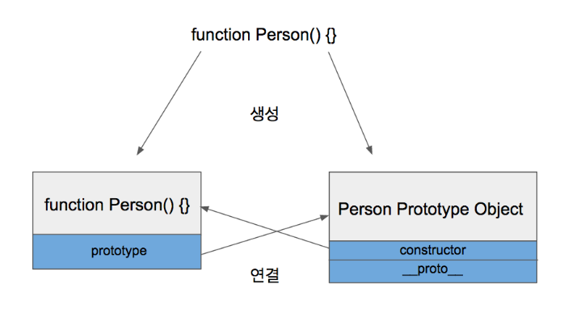
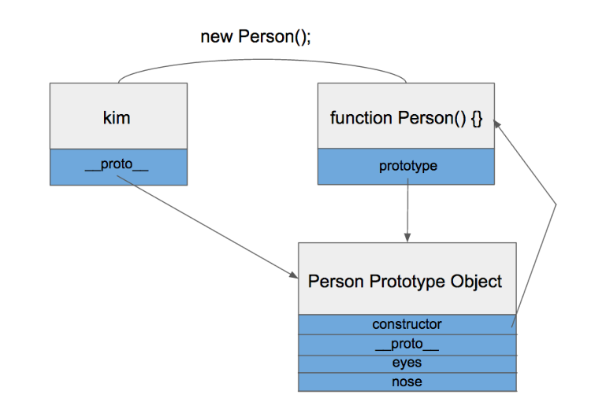

## Prototype
 - 객체지향언어인 Javascript에서 클래스의 역할
 - Prototype Link + Prototype Object
    - Prototype Object : 객체는 항상 함수로 생성 되며 new를 통해 객체를 만들어낼 수 있는 Constructor 와 _proto_를 가진다.
    <p align="center"></p>
    - Prototype Link : _proto_속성을 통해 상위 프로토타입과 연결되어있는 형태를 프로토타입 체인
    <p align="center"></p>

## 적용 전 : 객체의 갯수만큼 생성하여 사용하게 된다 => 메모리 낭비
```
function Person() {
  this.eyes = 2;
  this.nose = 1;
}
var kim  = new Person();
var park = new Person();
console.log(kim.eyes);  // => 2
console.log(kim.nose);  // => 1
console.log(park.eyes); // => 2
console.log(park.nose); // => 1
```

## 적용 후 : 생성된 객체들을 가져다쓸 수 있다.
```
function Person() {}
Person.prototype.eyes = 2;
Person.prototype.nose = 1;
var kim  = new Person();
var park = new Person():
console.log(kim.eyes); // => 2
...
```

## Reference
<a href="https://medium.com/@bluesh55/javascript-prototype-%EC%9D%B4%ED%95%B4%ED%95%98%EA%B8%B0-f8e67c286b67">[Javascript ] 프로토타입 이해하기</a>
