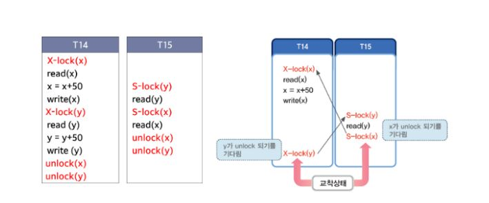

* ACID : 원자성(모든 작업이 반영되거나 모두 롤백), 일관성(미리 정의된 규칙에 의해서 수정 가능), 고립성(트랜잭션 수행 시 다른 트랜잭션이 끼어들지 못함), 영구성(영원히 적용)
* 트랜잭션 : 데이터베이스의 논리적 작업 단위 (All or Not)

## 데이터베이스 동시성제어
 - DB 시스템에서 동시에 실행되는 여러 트랜잭션 간의 간섭 문제가 발생되자 않도록 실행순서를 제어하는 기법
 - 간섭으로 인해 갱신 분실, 연쇄 복귀, 회복 불가능, 불일치 분석 문제가 발생
    - 갱신 분실 : 트랜잭션이 동일한 데이터를 동시에 갱신하여 갱신값을 덮어씀
    - 연쇄 복귀 : 트랜잭션 복구 시 다른 문제없는 트랜잭션이 연달아 복귀함
    - 불일치 분석 : 한 트랜잭션 실행시 다른 트랜잭션이 끼어들기로 인한 문제
 - 끼어들기 문제 해결을 위해 직렬 스케줄(최적의 방법x) or 직렬 가능한 스케줄(Locking)로 만들어서 사용

## Locking 
 - 하나의 트랜잭션이 실행하는 다른 트랜잭션이 동시에 접근하지 못하도록 상호배제기능 제공 => 데이터를 독점적으로 사용가능
 - lock과 unlock 연산을 사용하여 공유잠금 및 배타잠금을 사용하여 데이터 항목에 접근
    - 공유잠금(S-lock) : 읽기 연산만 가능하여 여러 트랜잭션도 s-lock 설정 가능
    - 배타잠금(X-lock) : 읽기와 쓰기 연산을 지원하며 동시에 여러개의 배타 잠금 불가능
 - 잠금의 단위는 잠금의 대상이 되는 데이터 객체의 크기(레코드의 필드값 or 레코드 or 디스크 블록에서 크게 테이블이나 데이터베이스도 잠금단위)
 - 잠금의 단위가 클수록 병행성 수준이 낮아지고 동시성 제어 기법이 간단 | 작을수록 병행성 수준이 높아지고 관리는 복잡
 
## 잠금의 한계
 - 교착상태 : 교착상태에 빠지면 외부에서 강제로 트랜잭션을 중단하거나 잠금을 해제하지 않는 이상 무한정 대기

  

 - 2단계 자금 규약 : 잠금을 설정하는 단계와 해제하는 단계로 나누어 수행(직렬성 보장, 교착상태 예방 불가능)
    - 확장단계(growing phase) : 트랜잭션이 lock 연산만 수행할 수 있고 unlock 연산은 수행할 수 없는 단계
    - 축소단계(shrinking phase) : 트랜잭션이 unlock 연산만 수행할 수 있고 lock 연산은 수행할 수 없는 단계
 - 엄격한 2단계 잠금 규약 : 모든 X-lock에 대한 unlock 연산을 트랜잭션이 완전히 완료된 후에 실행

## 타임 스탬프
 - 읽거나 변경할 데이터에 대해 트랜잭션을 실행하기 전에 타임 스탬프를 부여하고 타임 스탬프 순서에 따라 트랜잭션 작업을 수행

## Reference
<a href="https://medium.com/pocs/%EB%8F%99%EC%8B%9C%EC%84%B1-%EC%A0%9C%EC%96%B4-%EA%B8%B0%EB%B2%95-%EC%9E%A0%EA%B8%88-locking-%EA%B8%B0%EB%B2%95-319bd0e6a68a">동시성 제어기법</a>  
<a href="http://elearning.kocw.net/document/lec/2011/AnDong/SongHeeHeon/09.pdf">자료</a>
