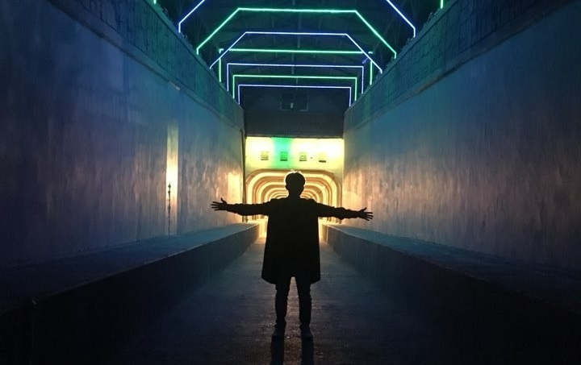

 

<h1><b>Motto</b></h1>
  

"세상에 필요한 사람이 되자"
  

"어려운건 있어도 안되는건 없다"
  

"점이 모아져서 선이되고 선이 모아져서 그림이 된다"
  

"사과를 사서 먹는 사람보다 키워 먹는 사람이 깊이가 있다"
  

"죽은 물고기만 물살에 몸을 맡긴다"
  

## Education
 - 2013.03 ~ 2019.08 전남대학교 컴퓨터정보통신공학과 학사졸업
 - 2019.07 ~ 2020.06 삼성 청년 SW 아카데미 수료  
 
## SKILL
 - language : Java, Python, JavaScript
 - Framework : Spring, Flask, Vue.js
 - Database : Mysql
 - etc : scikit, Pandas, Github, Jira  
 
## Certificate
- 정보처리기사
- OPIC : IL
- SW 역량테스트 : Level A  
- Database :SQLD  

## PROJECT
* <a href="https://limkinam.github.io/Bridge/">화상 면접 서비스 + AI 표정 분석 시각화

* <a href="https://limkinam.github.io/MBTI/">자기소개서 MBTI 분석 서비스  

* <a href="https://limkinam.github.io/Javer/">청년 맞춤형 재태크 포털 웹 서비스 개발 </a>

* <a href="https://limkinam.github.io/Bank_Bigdata/">Kaggle 금융관련 데이터셋 분석 및 정제를 통해 예측 모델 추출/ 사용자의 웹 서비스 제공  

* <a href="https://limkinam.github.io/SafeFood/">안전먹거리를 주제로 회원들의 BMI, 알레르기, 일일 권장 섭취량 등을 관리 해주는 Web 서비스 개발  
    
* <a href="https://limkinam.github.io/face_recognition/">얼굴 인식 시스템을 이용하여 이미지 가공 및 합성 </a>
